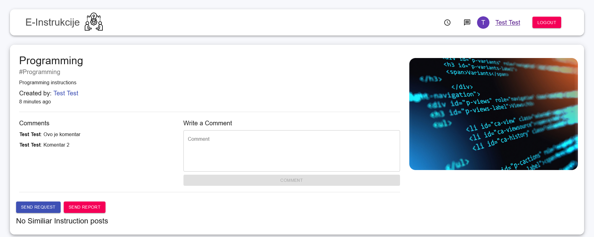

# InstrukcijeApp

## Table of contents
* [General info](#general-info)
* [Technologies](#technologies)
* [Setup](#setup)
* [Features](#features)
* [Screenshots](#screenshots)

## General info
This project is web application for creating and publishing instruction posts.
	
## Technologies
Project is created with:
* Node.js
* React
* Socket.io

## Features
- View instruction posts
- Search for instruction posts
- Create your profile
- Create instruction post
- View other people profiles
- Comment instruction posts
- Chat using messenger part of app
- Send request for instructions
	
## Setup
To run this project, install server, socket and client locally using npm:

```
$ cd /server
$ npm install
$ npm start

$ cd /socket
$ npm install
$ npm start

$ cd /client
$ npm install
$ npm start
```

## Screenshots




